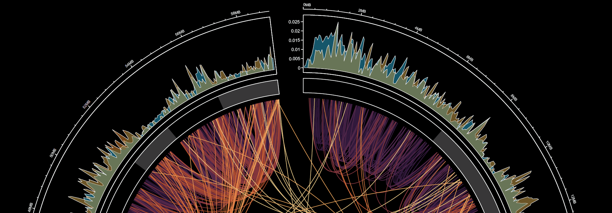

# Echinoderm_Regeneration [^1]
 ###### Summer Internship project at the Univeristy of North Carolina at Charlotte.
## Overview[^2]

### Sea Cucumber Genome Project
- - Literature Review
- - Fastqc, Trimmomatic, Star and Braker Scripts and Results
- - De novo ABySS assemblage, Exonerate Alignment Scripts and Results
### Genome Assembly Result Conversion (GTF Convert)
-- Series of scripts that converters outputs from different programs (BLAST, exonerate, and CD-HIT) to GTF format.

Notes:
[^1]: This is an ongoing repository that will be *archived* in May 2022.
[^2]: WIPs remain unchecked.
