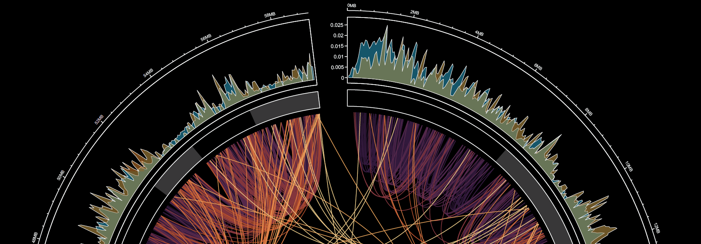
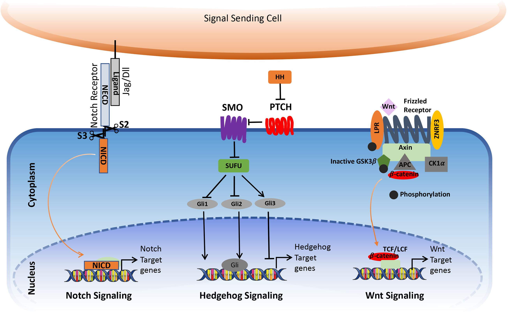
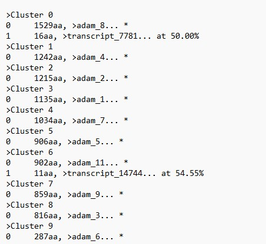
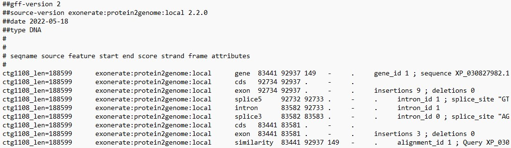
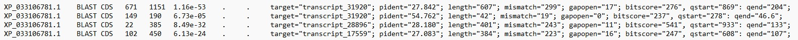
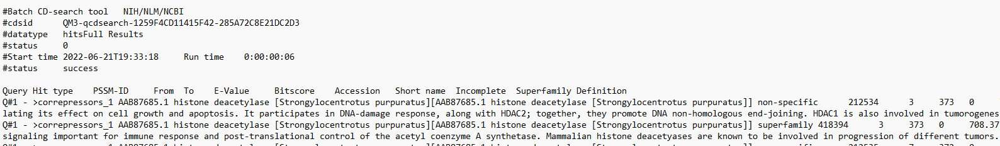

# Echinoderm_Regeneration [^1]
 ###### Summer Internship project at the Univeristy of North Carolina at Charlotte.
 
## Overview[^2]

### Sea Cucumber Genome Project
- - Literature Review
- - Fastqc, Trimmomatic, Star and Braker Scripts and Results
- - De novo ABySS assemblage, Exonerate Alignment Scripts and Results 

### [Genome Assembly Convert and Capture (GTF Convert)](https://github.com/sojichld/gtf-convert)
- - Series of scripts that converters and integrates results from different aligners and clusteres (BLAST, exonerate, and CD-HIT) to GTF format file.
#### Annotation
- - Acquisition of Gene Annotations and Alignment against cannonical sequences in model organisms and other Echinoderms.
- - Referenced against uniprot and ncbi

____

## Delta-Notch and Wnt pathways in the context of Drosophila Melanogaster

_____
### NOTCH
|Domain|blastn|blastp|CDHIT|Exonerate (unfiltered)|
|---|---|---|---|---|
|hairless|10|9|3|47|
|notch1|14|20|8|33|
|adam|17|   |   |59|
|p300|   |   |   |60|
|nack|   |   |   |44|
|modifiers|   |   ||70|
|mindbomb|   |   |   |22|
|nack|   |   |   |40|
|hes|   |   |   |17|
|csl|   |   |   |47|
|gammas_secretase|   |   |   |43|

### WNT
|Domain|blastn|blastp|CDHIT|Exonerate (Unfiltered)|
|---|---|---|---|---|
|znrf3 |   |   |   |30|
|wls|   |   |   |18|
|tspan12|   |   |   |19|
|tcf|   |   |   |107|
|sfrp|   |   |   |33|
|sclerostin|   |   |   |25|
|rnf43|   |   |   |29|
|r-spondin|   |   |   |41|
|porcupine|   |   |   |29|
|notum|   |   |   |39|
|norin|8|6|4|7|
|kremen|   |   |   |17|
|lgr5|   |   |   |55|
|gsk3|   |   |   |26|
|groucho|   |   |   |35|
|dishevelled|   |   |   |41|
|geta-catenin|   |   |   |13|
|ck1|   |   |   |49|
|axin|   |   |   |18|
|apc|   |   |   |38|
|frizzled|   |   |   |33|

1. Exonerate, CDHIT and BLAST Outputs converted independently for parsing into multifasta

2. 

3. NCBI CDD Hits parsed for canonical domains and ascensions.

Notes:
[^1]: This is an ongoing repository that will be *archived* in May 2023.
[^2]: WIPs remain unchecked.
